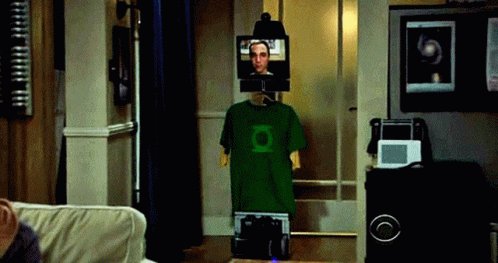

<h1 align="center">Hey there! I'm Nanda 👋</h1>

  Software Engineer focused on Front-end Architecture, React Ecosystem and scalable applications.

  

---

## 👩‍💻 About Me

- 💼 Front-end Developer at Grupo BYX  
- ⚛️ Specialized in React, TypeScript and Next.js  
- 🧩 Building scalable applications, Design Systems and reusable interfaces  
- 🧪 Focused on testing, architecture and code quality  
- 🔐 Cybersecurity enthusiast  
- 🐱 Cat person — my pet is called Byte  
- 🕸️ Favorite Spider-Man: Tobey Maguire  

---

## 🚀 Tech Stack

  
  &nbsp;
  
  &nbsp;
  
  &nbsp;
  
  &nbsp;
  
  &nbsp;
  
  &nbsp;
  

---

## 🛠️ Tools & Libraries

  
  &nbsp;
  
  &nbsp;
  
  &nbsp;
  
  &nbsp;
  
  &nbsp;
  
  &nbsp;
  

---

## 🌐 Connect with me

  
  &nbsp;
  

---

  

